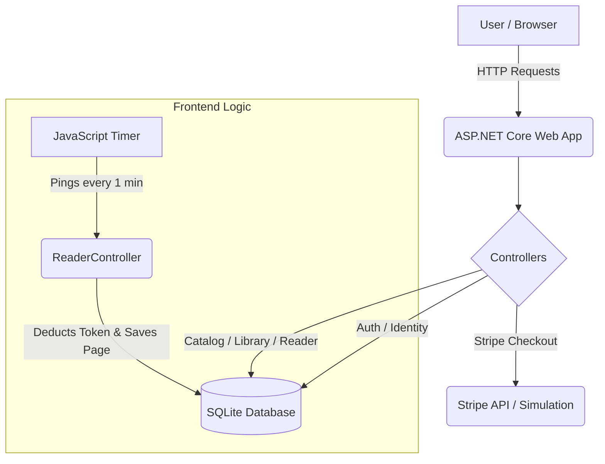
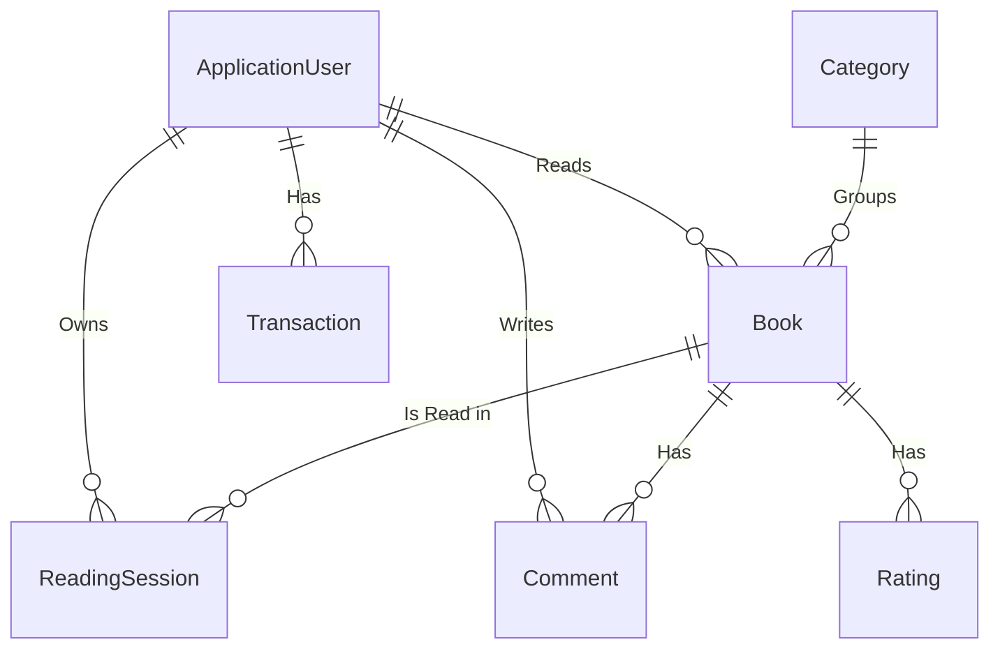

# RaceReader

RaceReader is a specialized pay-per-minute web platform dedicated to motorsport literature, driver biographies, and technical racing magazines. Instead of traditional monthly subscriptions, users purchase "Tokens" (1 token = 10 minutes of reading) and spend them dynamically as they read.

## Features

- **Dynamic Reading Timer**: Users pay exactly for the time they spend reading. A background tracker pings the server every minute to deduct tokens, providing a fair "pay-as-you-read" model.
- **Driver Dashboard**: A personal library area to track currently reading books, reading history, and token transaction history.
- **Role-Based Access**: 
  - **Readers**: Can browse the catalog, read books, leave reviews, and top up tokens.
  - **Admin**: Has full CRUD over the catalog (Books, Categories), user management (view balances, emails), and transaction logs.
- **Community Reviews**: Users can rate books (1-5 stars) and leave comments that appear on the book's details page.
- **Stripe Checkout Simulation**: A working mock for purchasing tokens. Includes session creation and webhook logic structures ready for real Stripe keys.

## Tech Stack

- **Backend**: ASP.NET Core 8 MVC
- **Database**: SQLite with Entity Framework Core
- **Frontend**: Razor Pages/Views, Vanilla JS (for timer), TailwindCSS (for styling)
- **Identity**: Default ASP.NET Core Identity for authentication

## Architecture Diagram

## Database Schema

## How to Run

1. Clone the repository.
2. Ensure you have the `.NET 8 SDK` installed.
3. Build the project: `dotnet build`
4. Apply migrations and create the SQLite database (handled automatically on startup via `DbInitializer`).
5. Run the project: `dotnet run`
6. Access the site via the localhost URL provided in the terminal output.

## Admin Access
The default admin account is seeded on first launch.
- **Email**: admin@racereader.com
- **Password**: Admin123!
